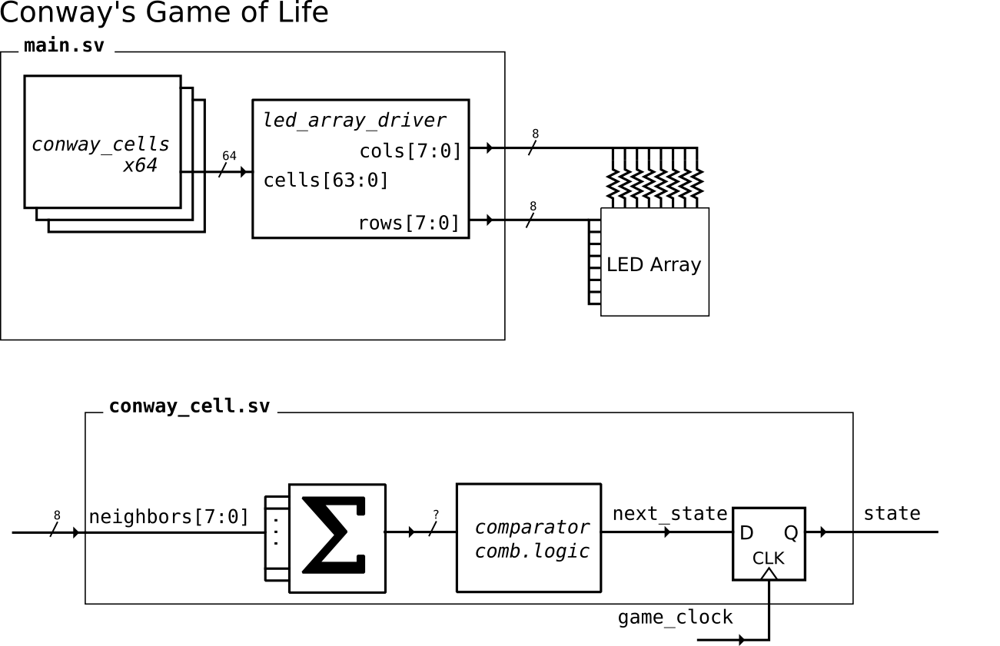

# Conway's Game of Life
In this lab you will implement a version of [Conway's Game of Life](https://en.wikipedia.org/wiki/Conway%27s_Game_of_Life).

Here's a  of what we'll be making.

# Lab Submission Checklist
Your submission will be generated by `make clean; make submission`
[ ] Lab log/design notebook. You can put your notes in this README, but any sketches/etc. should be included, preferably in PDF form, inside the `docs` directory.
[ ] Verilog files, FPGA configuration, etc.
[ ] Demo Check Ins - Get instructor sign offs on:
  [ ] Working 3_to_8 decoder simulation.
  [ ] Working game of life (test_main) simulation
  [ ] FPGA flashing - change the button gates
  [ ] FPGA flashing - update XDC file based on how you wired up the LEDs.
  [ ] FPGA flashing - working led array driver

Bonus:
[ ] Expand the grid from 5x5 to 8x8 using hand written logic.
[ ] Learn how to use generate statements to automate led_array logic for any size grid (see main.sv for example).

# Reference Materials
- [Cmod A7 FPGA Reference](https://digilent.com/reference/programmable-logic/cmod-a7/reference-manual)
- [8x8 LED Display Datasheet](https://cdn-shop.adafruit.com/datasheets/454datasheet.pdf) 

# Lab Walkthrough

There is  a `Makefile` in this project which lets us use `make target_name` to do various things in the project. For example `make clean` will get rid of all the generated files, and is very useful as a sanity check.

There should be enough examples to get you started, but in general:
- `make test_foo` will compile and run a simulation that you can then view with `gtkwave`. 
- `make main.bit` calls Vivado from the command line - *you will need to run `setup_xilinx` first!*
- `make program_fpga` calls Vivado from the command line - this assumes you've finished the cable driver part of the installation.
- `make submission` - call after `make clean`, creates a zip file of the things we need to grade you!

`main.sv` is the top level hardware description. This one has shows you some pretty advanced features that you will understand by end of class, but don't need to fully understand now. That said, *always skim `main.sv` to see the inputs, outputs, and parameters* for the module!

## 1. Simulation Practice

### a) decoders
This lab requires a 3:8 decoder. Template `.sv` files have been made for you, including a `test_decoders.sv` testbench. Create your 3:8 decoder, then show how you tested in in `test_decoders.sv`

### b) 1 bit adder
You will definitely need (at least) 1-bit adder. 

## 2. Conway's Game of Life - Cell Module
Edit `conway_cell.sv` and use `test_conway_cell.sv` to implement combinational logic and a flip flop that follows these rules:
1. Any live cell with two or three live neighbours survives (becomes 1'b1 at posedge clk).
2. Any dead cell with three live neighbours becomes a live cell (becomes 1'b1 at posedge clk).
3. All other live cells die in the next generation. Similarly, all other dead cells stay dead. (becomes 1'b0 at posedge clk).

Once it works, you can run `make test_main` to see a simulation of the full grid!

See if you can follow the examples in `main.sv` to change your initial conditions. If you change N you can simulate larger and larger grids! I put a fun `pulsar` example in for `N == 15`.

## 3. Flashing the FPGA
Ask the instructor for an FPGA and stub USB cable. The micro-usb connector on the FPGA is very fragile - *avoid plugging and unplugging directly into that!* Instead unplug and replug from the extension cable when power on and off.

*NEVER modify your breadboard circuitry while the FPGA is plugged in!*

The `main.sv` file has some simple logic for the built in LEDs based on the buttons. 
  - See if you can a) flash the FPGA and have it do what the code describes using `make program_fpga_vivado` or `make program_fpga_digilent` (tutorial in class).
  - *CRITICAL* you will need to edit `build.tcl` if you have a 35T class FPGA!!! There are comments showing what you need to do in that file.
  - Alter the button -> leds logic, then reflash to confirm that you can make changes!

## 4. LED Array Driver
- Read the datasheet of the LED driver to implement combinational logic that can drive the row and column pins of the LED array. This is pretty challenging, but think about what the voltages need to be at the row pin or the column pin based on the cell status and the status of our x decoder.

## 5. Build the circuit! 

See the schematic in the lecture notes and implement that on your breadboard. You only need to implement a 5x5 grid for the lab (though the 8x8 is much more fun). To avoid damaging LEDs contact an instructor before powering the circuit up!

If it doesn't work, debug in simulation first! 
