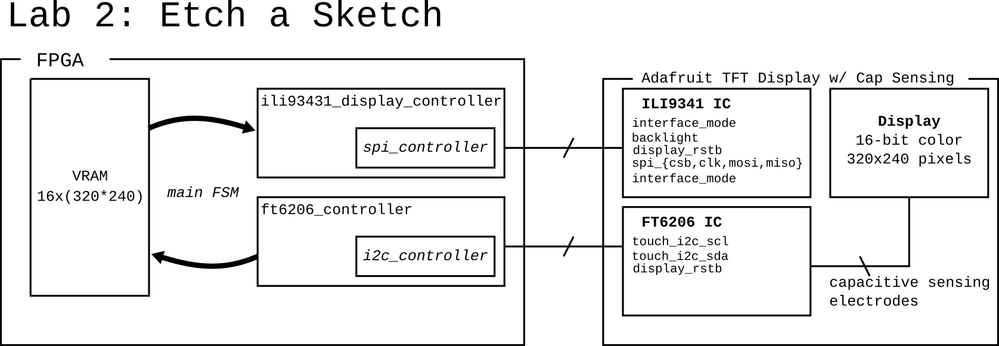

# Lab 2: Etch a Sketch

In this lab we're going to build logic to make an "etch a sketch" or sketchpad hardware device. Over the course of the lab you will learn how to:
* Design your own specifications for complex sequential and combinational logic blocks.
* Implement controllers for the popular SPI and i2c serial interfaces.
* Learn how to interface with both ROM and RAM memories.

This lab is more of a survey than an open ended design. After each section solutions to the prior one will be provided to help us keep moving and learning.

We're using [Adafruit's 2.8" TFT LCD with Cap Touch Breakout Board w/MicroSD Socket](https://www.adafruit.com/product/2090). Through the course of the lab we'll interface with following components on the breakout board.
- a 240x320 RGB TFT Display
- an ILI9341 Display Controller [datasheet](https://cdn-shop.adafruit.com/datasheets/ILI9341.pdf)
- an FT6206 Capacitive Touch Controller [datasheet](https://cdn-shop.adafruit.com/datasheets/FT6x06+Datasheet_V0.1_Preliminary_20120723.pdf) and [app note](https://cdn-shop.adafruit.com/datasheets/FT6x06_AN_public_ver0.1.3.pdf)
- (stretch) There is also an SD card on the display board, consider using it for a final project!

Last, there are a ton of best practice techniques hidden in this folder, I encourage you to explore to get some practice of learning from professional examples.

## Lab Report Details
- [ ] Pulse generator
- [ ] PWM Module
- [ ] Triangle Generator
- [ ] One of:
    - [ ] SPI Controller for Display
    - [ ] i2c Controller for touchscreen
- [ ] Learning from Professional Code: In your own words, describe the FSMs in:
    - [ ] `ili9341_display_controller.sv`
    - [ ] `ft6206_controller.sv`
- [ ] Design and implement a main FSM that interfaces with a video RAM.

# Part 1) Sequential Logic & FPGA Programming
Let's start with a simple example to make sure we all have the tools working and can effectively design, simulate, and synthesize combination logic and simple FSMs.

## Pulse Generator
Start by trying to implement a pulse generator - this is a module that outputs high for exactly one clock cycle out of every N ticks. Implement your code in `pulse_generator.sv`.

Get an instructor sign off by showing your working `gtkwave` simulation before proceeding!

## PWM Module
Pulse Width Modulation, or PWM is the first and easiest way of trying to get an analog or continuous value from a digital signal. Design and simulate an implementation in `pwm.sv`. Like before, show your working simulation in `gtkwave` before proceeding.

## Triangle Generator
A triangle or sawtooth generator is a counter that starts at zero, counts up to its maximum value, then counts down back to zero, etc. Implement a simple FSM, and show your waveforms to an instructor before proceeding.

## Putting it all together
Last, we're going to showcase the three above modules in `main.sv` by fading the LEDs in and out. To do this we'll use `pulse_generators` to generate some slower "step" signals that keep things changing at human rates. Next we'll use our `triangle_generator` to make a signal we can use to brighten and dim our LEDs. Finally, the `pwm` modules actually drive the LEDs.

All of this has been implemented in `main.sv` so you shouldn't have to make any changes. Start by doing a `make main.bit`, then use either `make program_fpga_vivado` or `make program_fpga_digilent` to program the FPGA. Remember to edit `build.tcl` to pick he right part on the `synth_design` line.

# Part 2) Serial Data Protocols

## Wiring the display:
If you are clever you can wire the display like so:

You then will only need to wire the GND pins to GND and the Vin pin to VU. The `main.xdc` pin assignment file has this layout commented out - check each pin to make sure it lines up before powering your board.

There are two tracks for this portion - either working with the (a) display XOR (b) the touchscreen. For both tracks the high level FSMs and logic have been done for you since they are a little complicated! Your responsibility is to implement a module that can implement either SPI XOR i2c to talk to the display or touch screen. Both tracks deal with serialization, but the i2c option is slightly more complicated (since you need to both write and read data).  

Writing sequential testbenches is difficult, so the tests for this are already provided.

## 2a) Display Controller - Sending Serialized Data over SPI
Your goal for this section is to finish implementing `spi_controller.sv`, and to read through `ili9341_display_controller.sv` and understand it enough to change the test pattern. NOTE - you only need to implement the `WRITE_8` and `WRITE_16` modes! 

Once you have it working, make sure that the ILI9341 display controller in main.sv has the test pattern enabled: `.enable_test_pattern(1'b1)`. If your SPI controller is working you should see a test pattern on the display. 

Finally, edit `ili9341_display_controller.sv`'s `display_color_logic` section to change the test pattern in any way. Bonus - make the test pattern change over time by adding an FSM of some sort!

## 2b) Touchscreen Controller - Receiving Serialized Data over i2c
This part is a little more challenging. 
Your goal for this selection is to finish implementing `i2c_controller.sv` so that we can talk to the FT6206 touch screen controller on the display. Technically to use i2c you have to both send and receive serial data, but the focus of this is on receiving data from the capacitive touch sensor. There is a suggested `i2c_state_t` in `i2c_types.sv` - I encourage building your high level FSM around that. 

i2c can be a bit tricky of a protocol, so the real proof is if it works in synthesis. I recommend testing by mapping `touch0.x` and `touch0.y` to your debug LED pwm inputs when `touch0.valid` is high - that will make the two LEDs respond to the touch screen.

# Part 3) Interfacing with VRAM
Design and implement an FSM that can:
- [ ] clear memory on button press.
- [ ] update memory based on touch values.
- [ ] emit draw signals based on memory.
- [ ] bonus: add colors, different modes.
- [ ] stretch bonus: add fonts/textures! (hint, creating more ROMs (see `generate_memories.py` is a good way to approach this).